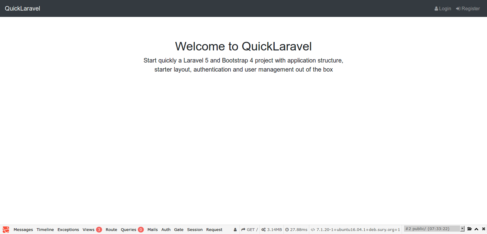
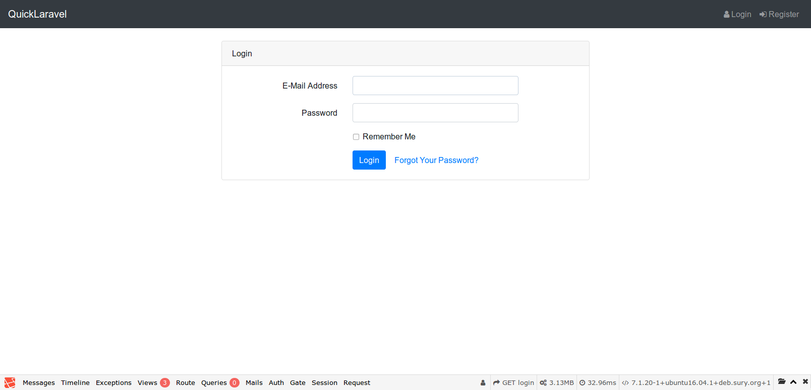
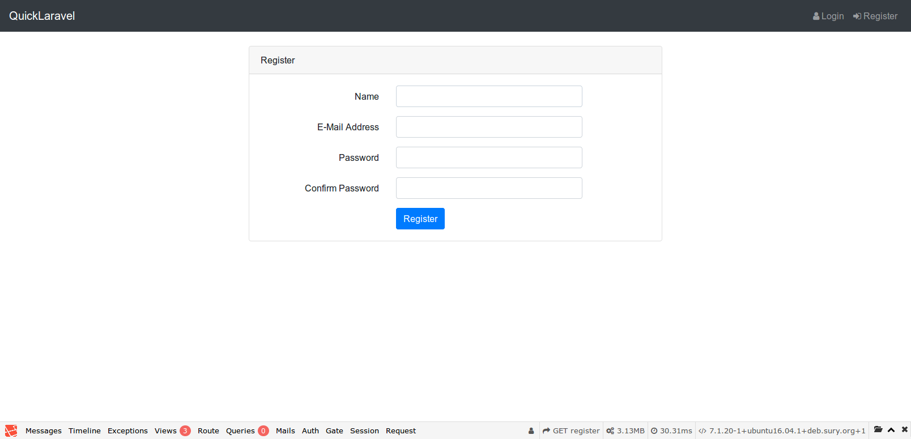
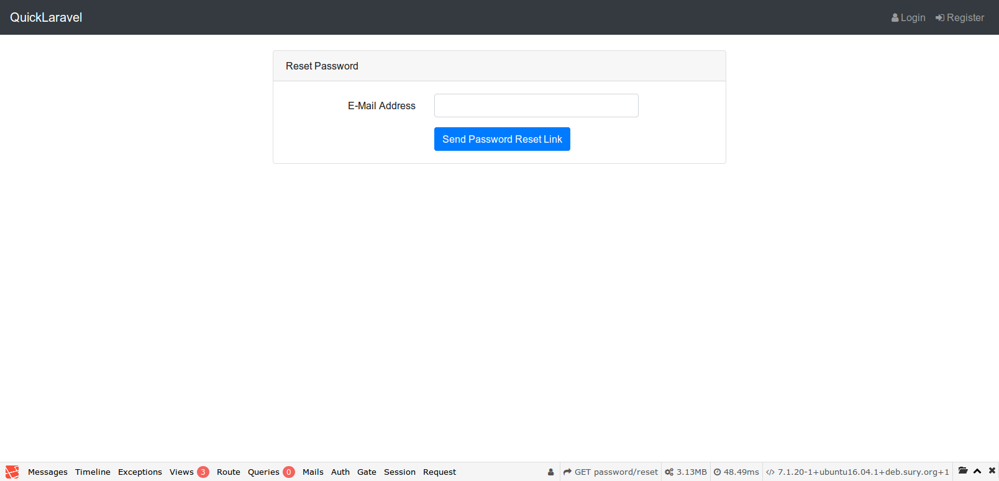
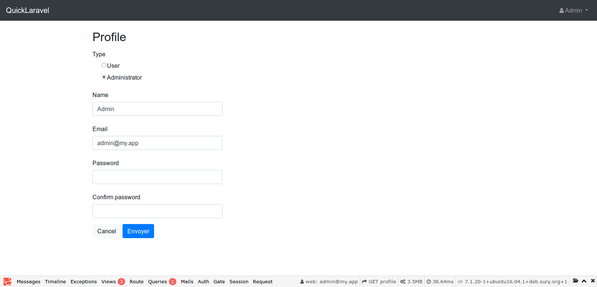
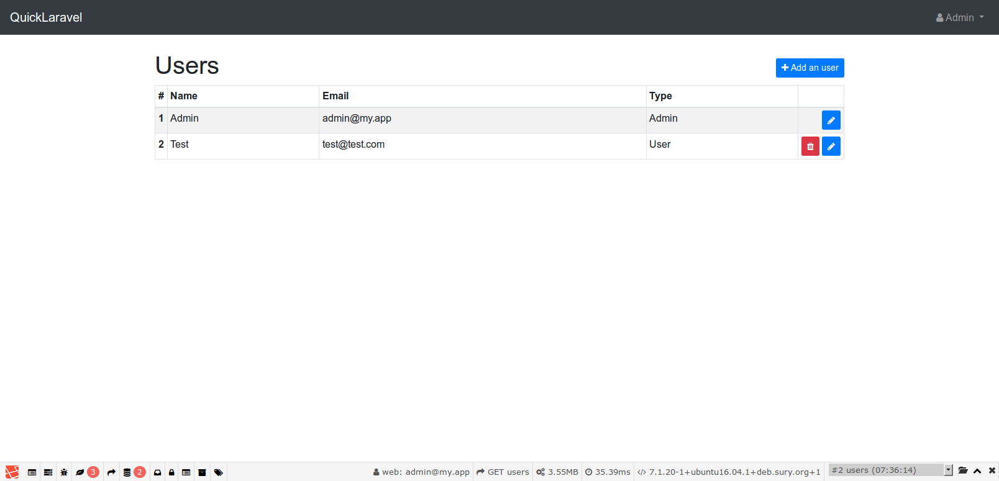

# Welcome to QuickLaravel

Start quickly a Laravel 5 and Bootstrap 4 project with application structure, starter layout, authentication and user management out of the box.

## Installation

+ Clone the project : `git clone cariagency/quick-laravel myapp`
+ Install dependencies: `cd myapp && composer install`
+ Run Laravel install scripts: `composer run-script post-root-package-install && composer run-script post-create-project-cmd` 
+ Update `.env` to fit your needs.
+ Run migrations: `php artisan migrate`
+ Seed database to create an admin user: `php artisan db:seed`

That's it !

You can log in using these credentials : `admin@my.app // admin`.  
Remeber to change them ;-)

## Screenshots

